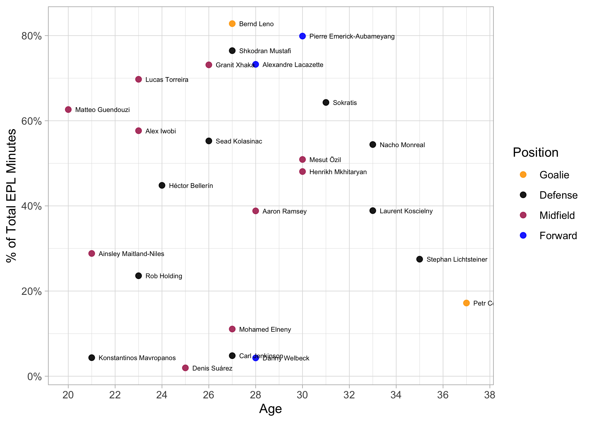
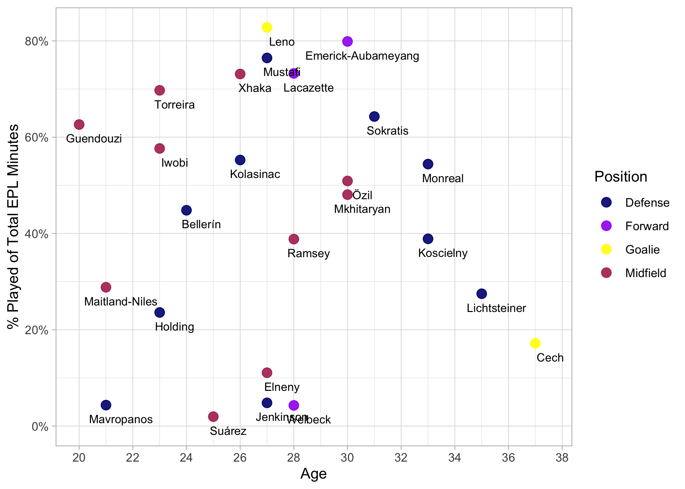
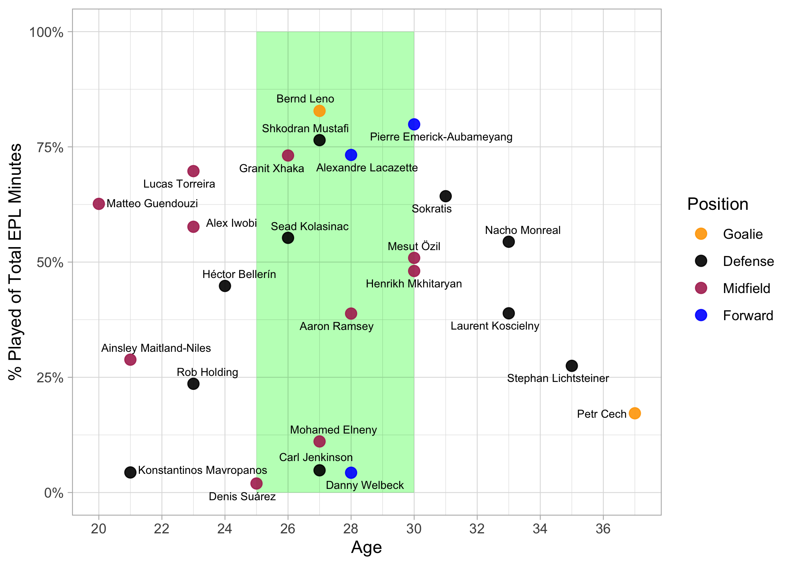
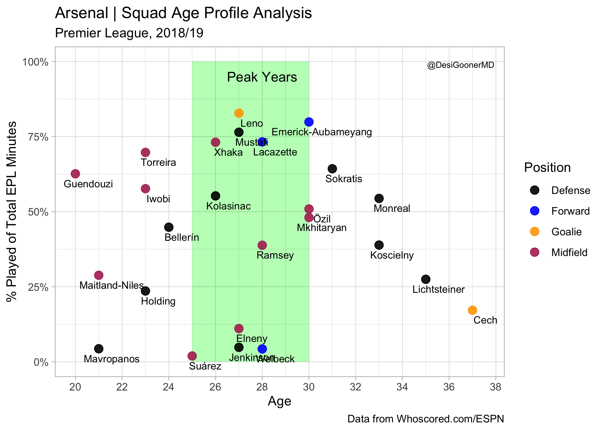

Arsenal Squad Age-Profile analysis
----------------------------------

This is small analytics exercise to examine the distribution of minutes
played based on the age of the players.

I got inspiration for this from the excellent
[article](http://petermckeever.com/2019/04/creating-squad-age-profiles/)
by @petermckeever.

His work was done in Python but I decided to try and re-create it using
R.

We will begin by scraping the player-ages for the squad from ESPNFC. One
thing I noticed was that they separated the goalie stats from the rest
of the squad so we will have to scrape two separate tables and combine
the data.

First, we’ll load our library dependencies and specify the squad page
URL we will be using.

``` r
library(tidyverse)
library(rvest)
library(lubridate)
library(stringr)
library(scales)

url <- "https://www.espn.com/soccer/team/squad/_/id/359/league/ENG.1/season/2018"
```

Next, we will scrape the goalie information. I had to check the page
source-code to determine the correct table-indexes.

``` r
goalie <- read_html(url) %>% 
  html_nodes("table") %>% 
  magrittr::extract2(3) %>% 
  html_table(fill = TRUE,  header = TRUE, trim = TRUE)
```

Now, we’ll extract the rest of the squad details from the 2nd table.

``` r
outfield <- read_html(url) %>% 
  html_nodes("table") %>% 
  magrittr::extract2(6) %>% 
  html_table(fill = TRUE,  header = TRUE, trim = TRUE)
```

Let’s combine both sets into a single dataframe and take a peek.

``` r
squad <- bind_rows(goalie, outfield)
```

Let’s continue by keeping only our columns of interest.

``` r
squad <- squad %>% 
  select(
    Name, 
    Position = POS, 
    Age, 
    HT, 
    WT, 
    NAT
    )

squad %>% pull(Name)
```

    ##  [1] "Petr Cech1"                  "Bernd Leno19"               
    ##  [3] "Héctor Bellerín2"            "Sokratis Papastathopoulos5" 
    ##  [5] "Laurent Koscielny6"          "Stephan Lichtsteiner12"     
    ##  [7] "Rob Holding16"               "Nacho Monreal18"            
    ##  [9] "Shkodran Mustafi20"          "Carl Jenkinson25"           
    ## [11] "Konstantinos Mavropanos27"   "Sead Kolasinac31"           
    ## [13] "Zech Medley47"               "Bukayo Saka87"              
    ## [15] "Mohamed Elneny4"             "Henrikh Mkhitaryan7"        
    ## [17] "Aaron Ramsey8"               "Mesut Özil10"               
    ## [19] "Lucas Torreira11"            "Ainsley Maitland-Niles15"   
    ## [21] "Alex Iwobi17"                "Denis Suárez22"             
    ## [23] "Matteo Guendouzi29"          "Granit Xhaka34"             
    ## [25] "Joseph Willock59"            "Alexandre Lacazette9"       
    ## [27] "Pierre-Emerick Aubameyang14" "Danny Welbeck23"            
    ## [29] "Edward Nketiah49"

We can also see we need to do some cleanup on the player names which
annoyingly have their number appended at the end. We can take care of
this easily though with a string replace using a regular expression.
Let’s do a quick sanity-check before we make the update to our
dataframe.

``` r
squad %>% mutate(Name = str_replace(Name, "\\d+$", "")) %>% pull(Name)
```

    ##  [1] "Petr Cech"                 "Bernd Leno"               
    ##  [3] "Héctor Bellerín"           "Sokratis Papastathopoulos"
    ##  [5] "Laurent Koscielny"         "Stephan Lichtsteiner"     
    ##  [7] "Rob Holding"               "Nacho Monreal"            
    ##  [9] "Shkodran Mustafi"          "Carl Jenkinson"           
    ## [11] "Konstantinos Mavropanos"   "Sead Kolasinac"           
    ## [13] "Zech Medley"               "Bukayo Saka"              
    ## [15] "Mohamed Elneny"            "Henrikh Mkhitaryan"       
    ## [17] "Aaron Ramsey"              "Mesut Özil"               
    ## [19] "Lucas Torreira"            "Ainsley Maitland-Niles"   
    ## [21] "Alex Iwobi"                "Denis Suárez"             
    ## [23] "Matteo Guendouzi"          "Granit Xhaka"             
    ## [25] "Joseph Willock"            "Alexandre Lacazette"      
    ## [27] "Pierre-Emerick Aubameyang" "Danny Welbeck"            
    ## [29] "Edward Nketiah"

OK, we can see the player-numbers were correctly removed from the Names
so we’ll go ahead and perform this cleaning step on our dataframe. While
we’re at it, let’s also remove the “lbs” label from the WT column and
convert it to an integer.

``` r
squad <- squad %>% 
  mutate(Name = str_replace(Name, "\\d+$", "")) %>% 
  mutate(WT = as.integer(str_replace(WT, "lbs", ""))) 
```

    ## Warning in rlang::eval_tidy(~as.integer(str_replace(WT, "lbs", "")),
    ## <environment>): NAs introduced by coercion

Next, let’s convert our HT values to a standard of inches. We’ll have to
separate out our height-feet and height-inches to calculate total height
in inches.

``` r
(squad <- squad %>% separate(HT, c("feet","inches","drop")) %>% 
  select(-drop) %>% 
  mutate_at(c("feet","inches"), as.integer) %>% 
  mutate(HT = (feet*12) + inches) %>% 
  select(Name, Position, Age, HT, WT, NAT) 
)
```

    ##                         Name Position Age HT  WT            NAT
    ## 1                  Petr Cech        G  37 77 198 Czech Republic
    ## 2                 Bernd Leno        G  27 75 183        Germany
    ## 3            Héctor Bellerín        D  24 70 161          Spain
    ## 4  Sokratis Papastathopoulos        D  31 73 181         Greece
    ## 5          Laurent Koscielny        D  33 73 163         France
    ## 6       Stephan Lichtsteiner        D  35 71 152    Switzerland
    ## 7                Rob Holding        D  23 74 163        England
    ## 8              Nacho Monreal        D  33 70 159          Spain
    ## 9           Shkodran Mustafi        D  27 72 181        Germany
    ## 10            Carl Jenkinson        D  27 73 170        England
    ## 11   Konstantinos Mavropanos        D  21 76 192         Greece
    ## 12            Sead Kolasinac        D  26 72 185        Germany
    ## 13               Zech Medley        D  19 77  NA        England
    ## 14               Bukayo Saka        D  17 70  NA        England
    ## 15            Mohamed Elneny        M  27 71 161          Egypt
    ## 16        Henrikh Mkhitaryan        M  30 70 163        Armenia
    ## 17              Aaron Ramsey        M  28 70 168          Wales
    ## 18                Mesut Özil        M  30 71 168        Germany
    ## 19            Lucas Torreira        M  23 66 139        Uruguay
    ## 20    Ainsley Maitland-Niles        M  21 70 157        England
    ## 21                Alex Iwobi        M  23 71 163        Nigeria
    ## 22              Denis Suárez        M  25 69 150          Spain
    ## 23          Matteo Guendouzi        M  20 73 139         France
    ## 24              Granit Xhaka        M  26 72 181    Switzerland
    ## 25            Joseph Willock        M  19 70 157        England
    ## 26       Alexandre Lacazette        F  28 69 161         France
    ## 27 Pierre-Emerick Aubameyang        F  30 74 174          Gabon
    ## 28             Danny Welbeck        F  28 72 161        England
    ## 29            Edward Nketiah        F  20 69 159        England

For our final cleaning step, we will convert the POS column which holds
the player’s position to a factor and change the level names.

``` r
squad_new <- squad %>% 
  mutate(Position = factor(Position, levels=c("G","D","M","F"), labels=c("Goalie","Defense","Midfield","Forward")))
```

Now, we’ll load our player-ratings data that was scraped from
[WhoScored.com](http://whoscored.com)

``` r
ratings <- readRDS("arsenal_whoscored_player_ratings.rds") %>% as_tibble
```

We’ll aggregate to the player-level taking the average of their rating
and calculate total minutes played.

``` r
player_agg <- ratings %>% 
  group_by(player_name) %>% 
  summarize(total_mins = sum(minutes_played), avg_rating = mean(rating)
            ) %>% 
  arrange(desc(total_mins))
```

Now, we’ll combine our aggregated player dataframe with our squad
profile. This will serve as our datasource for our viz. I did have to
make edits to Aubameyang’s and Sokratis’s names so that their data would
align with our ratings data.

``` r
squad_new[27,"Name"] = "Pierre Emerick-Aubameyang"
squad_new[4, "Name"] = "Sokratis"

afc <- inner_join(squad_new, player_agg, by=c("Name"="player_name"))
```

Now, let’s produce our viz.

``` r
theme_set(theme_light())

afc %>% 
  ggplot(aes(x = Age, y = total_mins/(38*90), label = Name)) +
  geom_point(aes(color = Position), size = 3.0, alpha = 0.9) +
  geom_text(size = 3, vjust = "middle", hjust = "left", nudge_x = 0.3) +
  scale_color_manual(values = c("orange","black","maroon","blue")) +
  scale_x_continuous(breaks = seq(18,40, by=2)) +
  scale_y_continuous(labels = scales::percent_format()) +
  labs(y = "% of Total EPL Minutes")
```



We can see the graph looks a bit messy with some overlapping names. We
can use the `check_overlap` property to help deal with this, but I found
it removed several key players from the graph.

Another option to clean things up is by showing only the last-name.
We’ll use the handy tidyr `extract` function to accomplish this.

``` r
afc <- extract(afc, Name, c("fname","lname"), "([^ ]+)(.*)", remove = FALSE)

afc[4, "lname"] = "Sokratis"

p <- afc %>% ggplot(aes(x = Age, y = total_mins/(38*90), label = lname))

p + 
  geom_point(aes(color = Position), size = 3.0, alpha = 0.9) +
  geom_text(size = 3, vjust = "top", hjust = "middle", nudge_y = -0.02, nudge_x = 0.5) +
  scale_color_manual(values = c("orange","black","maroon","blue")) +
  scale_x_continuous(breaks = seq(18,40, by=2)) +
  scale_y_continuous(labels = scales::percent_format()) +
  labs(y = "% Played of Total EPL Minutes")
```



This looks good but let’s go one-step farther by adding a shaded region
showing the peak age-bracket which we’ll define as from 25 - 30 years
old.

``` r
p <- p +
  geom_rect(fill = "green", alpha = 0.01, aes(xmin=25, xmax=30, ymin=0, ymax=1)) +
  geom_point(aes(color = Position), size = 3.0, alpha = 0.9) +
  geom_text(size = 3, vjust = "top", hjust = "middle", nudge_y = -0.02, nudge_x = 0.5) +
  scale_color_manual(values = c("orange","black","maroon","blue")) +
  scale_x_continuous(breaks = seq(18,40, by=2)) +
  scale_y_continuous(labels = scales::percent_format()) +
  labs(y = "% Played of Total EPL Minutes")

p
```



we’ll wrap up by adding a title and some annotations.

``` r
p + labs(
  title = "Arsenal | Squad Age Profile Analysis",
  subtitle = "Premier League, 2018/19",
  caption = "Data from Whoscored.com/ESPN"
) +
  annotate("text", x = 28, y = 0.95, label = "Peak Years", size = 4.0)
```


