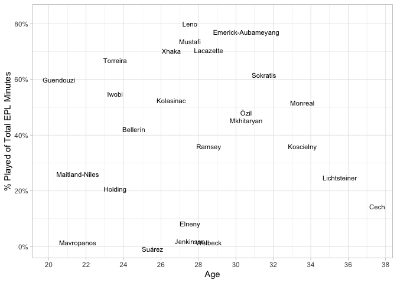

Arsenal Squad Age-Profile analysis
----------------------------------

This is small analytics exercise to examine the distribution of minutes
played based on the age of the players.

I got inspiration for this from the excellent
[http://petermckeever.com/2019/04/creating-squad-age-profiles/](article)
by @petermckeever.

His work was done in Python but I decided to try and re-create it using
R.

We will begin by scraping the player-ages for the squad from ESPNFC. One
thing I noticed was that they separated the goalie stats from the rest
of the squad so we will have to scrape two separate tables and combine
the data.

First, we’ll load our library dependencies and specify the squad page
URL we will be using.

    library(tidyverse)
    library(rvest)
    library(lubridate)
    library(stringr)
    library(scales)

    url <- "https://www.espn.com/soccer/team/squad/_/id/359/league/ENG.1/season/2018"

Next, we will scrape the goalie information. I had to check the page
source-code to determine the correct table-indexes.

    goalie <- read_html(url) %>% 
      html_nodes("table") %>% 
      magrittr::extract2(3) %>% 
      html_table(fill = TRUE,  header = TRUE, trim = TRUE)

Now, we’ll extract the rest of the squad details from the 2nd table.

    outfield <- read_html(url) %>% 
      html_nodes("table") %>% 
      magrittr::extract2(6) %>% 
      html_table(fill = TRUE,  header = TRUE, trim = TRUE)

Let’s combine both sets into a single dataframe and take a peek.

    squad <- bind_rows(goalie, outfield)

    squad

    ##                           Name POS Age     HT      WT            NAT APP
    ## 1                   Petr Cech1   G  37  6' 5" 198 lbs Czech Republic   7
    ## 2                 Bernd Leno19   G  27  6' 3" 183 lbs        Germany  32
    ## 3             Héctor Bellerín2   D  24 5' 10" 161 lbs          Spain  19
    ## 4   Sokratis Papastathopoulos5   D  31  6' 1" 181 lbs         Greece  25
    ## 5           Laurent Koscielny6   D  33  6' 1" 163 lbs         France  17
    ## 6       Stephan Lichtsteiner12   D  35 5' 11" 152 lbs    Switzerland  14
    ## 7                Rob Holding16   D  23  6' 2" 163 lbs        England  10
    ## 8              Nacho Monreal18   D  33 5' 10" 159 lbs          Spain  22
    ## 9           Shkodran Mustafi20   D  27  6' 0" 181 lbs        Germany  31
    ## 10            Carl Jenkinson25   D  27  6' 1" 170 lbs        England   3
    ## 11   Konstantinos Mavropanos27   D  21  6' 4" 192 lbs         Greece   4
    ## 12            Sead Kolasinac31   D  26  6' 0" 185 lbs        Germany  24
    ## 13               Zech Medley47   D  19  6' 5"       -        England   0
    ## 14               Bukayo Saka87   D  17 5' 10"       -        England   1
    ## 15             Mohamed Elneny4   M  27 5' 11" 161 lbs          Egypt   8
    ## 16         Henrikh Mkhitaryan7   M  30 5' 10" 163 lbs        Armenia  25
    ## 17               Aaron Ramsey8   M  28 5' 10" 168 lbs          Wales  28
    ## 18                Mesut Özil10   M  30 5' 11" 168 lbs        Germany  24
    ## 19            Lucas Torreira11   M  23  5' 6" 139 lbs        Uruguay  34
    ## 20    Ainsley Maitland-Niles15   M  21 5' 10" 157 lbs        England  16
    ## 21                Alex Iwobi17   M  23 5' 11" 163 lbs        Nigeria  35
    ## 22              Denis Suárez22   M  25  5' 9" 150 lbs          Spain   4
    ## 23          Matteo Guendouzi29   M  20  6' 1" 139 lbs         France  33
    ## 24              Granit Xhaka34   M  26  6' 0" 181 lbs    Switzerland  29
    ## 25            Joseph Willock59   M  19 5' 10" 157 lbs        England   2
    ## 26        Alexandre Lacazette9   F  28  5' 9" 161 lbs         France  35
    ## 27 Pierre-Emerick Aubameyang14   F  30  6' 2" 174 lbs          Gabon  36
    ## 28             Danny Welbeck23   F  28  6' 0" 161 lbs        England   8
    ## 29            Edward Nketiah49   F  20  5' 9" 159 lbs        England   5
    ##    SUB  SV GA A FC FA YC RC     G SH ST
    ## 1    0  28  9 0  0  2  0  0 NA NA NA NA
    ## 2    1 102 42 0  0  5  0  0 NA NA NA NA
    ## 3    1  NA NA 5 16  6  3  0 NA  0 18  4
    ## 4    0  NA NA 2 37 25 12  0 NA  1 11  2
    ## 5    4  NA NA 0  9 14  1  0 NA  3  5  4
    ## 6    4  NA NA 0 11 10  3  0 NA  0  1  0
    ## 7    1  NA NA 0  6  2  1  0 NA  0  2  0
    ## 8    1  NA NA 3 17 21  5  0 NA  1  7  4
    ## 9    0  NA NA 0 42  8  9  0 NA  2 18  9
    ## 10   1  NA NA 0  1  0  0  0 NA  0  0  0
    ## 11   1  NA NA 0  2  0  1  0 NA  0  2  0
    ## 12   2  NA NA 5 21 10  5  0 NA  0  9  2
    ## 13   0  NA NA 0  0  0  0  0 NA  0  0  0
    ## 14   1  NA NA 0  0  0  0  0 NA  0  0  0
    ## 15   3  NA NA 0  1  0  0  0 NA  0  7  0
    ## 16   6  NA NA 4 27 10  1  0 NA  6 49 14
    ## 17  14  NA NA 6 21 20  0  0 NA  4 33 13
    ## 18   4  NA NA 2 10 22  2  0 NA  5 11  6
    ## 19  10  NA NA 2 38 77  7  1 NA  2 25  6
    ## 20   5  NA NA 1  8 12  1  1 NA  1  5  3
    ## 21  13  NA NA 6  8 13  0  0 NA  3 35 14
    ## 22   4  NA NA 0  0  1  0  0 NA  0  0  0
    ## 23  10  NA NA 0 24 62  9  0 NA  0 16  4
    ## 24   0  NA NA 2 45 52 10  0 NA  4 29 12
    ## 25   1  NA NA 0  0  2  0  0 NA  0  2  0
    ## 26   8  NA NA 8 51 54  2  0 NA 13 81 30
    ## 27   6  NA NA 5 13 23  0  0 NA 22 94 40
    ## 28   7  NA NA 1  3  2  0  0 NA  1  4  2
    ## 29   5  NA NA 0  1  2  0  0 NA  1  3  1

Let’s continue by keeping only our columns of interest.

    squad <- squad %>% 
      select(
        Name, 
        Position = POS, 
        Age, 
        HT, 
        WT, 
        NAT
        )

    squad

    ##                           Name Position Age     HT      WT            NAT
    ## 1                   Petr Cech1        G  37  6' 5" 198 lbs Czech Republic
    ## 2                 Bernd Leno19        G  27  6' 3" 183 lbs        Germany
    ## 3             Héctor Bellerín2        D  24 5' 10" 161 lbs          Spain
    ## 4   Sokratis Papastathopoulos5        D  31  6' 1" 181 lbs         Greece
    ## 5           Laurent Koscielny6        D  33  6' 1" 163 lbs         France
    ## 6       Stephan Lichtsteiner12        D  35 5' 11" 152 lbs    Switzerland
    ## 7                Rob Holding16        D  23  6' 2" 163 lbs        England
    ## 8              Nacho Monreal18        D  33 5' 10" 159 lbs          Spain
    ## 9           Shkodran Mustafi20        D  27  6' 0" 181 lbs        Germany
    ## 10            Carl Jenkinson25        D  27  6' 1" 170 lbs        England
    ## 11   Konstantinos Mavropanos27        D  21  6' 4" 192 lbs         Greece
    ## 12            Sead Kolasinac31        D  26  6' 0" 185 lbs        Germany
    ## 13               Zech Medley47        D  19  6' 5"       -        England
    ## 14               Bukayo Saka87        D  17 5' 10"       -        England
    ## 15             Mohamed Elneny4        M  27 5' 11" 161 lbs          Egypt
    ## 16         Henrikh Mkhitaryan7        M  30 5' 10" 163 lbs        Armenia
    ## 17               Aaron Ramsey8        M  28 5' 10" 168 lbs          Wales
    ## 18                Mesut Özil10        M  30 5' 11" 168 lbs        Germany
    ## 19            Lucas Torreira11        M  23  5' 6" 139 lbs        Uruguay
    ## 20    Ainsley Maitland-Niles15        M  21 5' 10" 157 lbs        England
    ## 21                Alex Iwobi17        M  23 5' 11" 163 lbs        Nigeria
    ## 22              Denis Suárez22        M  25  5' 9" 150 lbs          Spain
    ## 23          Matteo Guendouzi29        M  20  6' 1" 139 lbs         France
    ## 24              Granit Xhaka34        M  26  6' 0" 181 lbs    Switzerland
    ## 25            Joseph Willock59        M  19 5' 10" 157 lbs        England
    ## 26        Alexandre Lacazette9        F  28  5' 9" 161 lbs         France
    ## 27 Pierre-Emerick Aubameyang14        F  30  6' 2" 174 lbs          Gabon
    ## 28             Danny Welbeck23        F  28  6' 0" 161 lbs        England
    ## 29            Edward Nketiah49        F  20  5' 9" 159 lbs        England

We can also see we need to do some cleanup on the player names which
annoyingly have their number appended at the end. We can take care of
this easily though with a string replace using a regular expression.
Let’s do a quick sanity-check before we make the update to our
dataframe.

    squad %>% mutate(Name = str_replace(Name, "\\d+$", "")) %>% pull(Name)

    ##  [1] "Petr Cech"                 "Bernd Leno"               
    ##  [3] "Héctor Bellerín"           "Sokratis Papastathopoulos"
    ##  [5] "Laurent Koscielny"         "Stephan Lichtsteiner"     
    ##  [7] "Rob Holding"               "Nacho Monreal"            
    ##  [9] "Shkodran Mustafi"          "Carl Jenkinson"           
    ## [11] "Konstantinos Mavropanos"   "Sead Kolasinac"           
    ## [13] "Zech Medley"               "Bukayo Saka"              
    ## [15] "Mohamed Elneny"            "Henrikh Mkhitaryan"       
    ## [17] "Aaron Ramsey"              "Mesut Özil"               
    ## [19] "Lucas Torreira"            "Ainsley Maitland-Niles"   
    ## [21] "Alex Iwobi"                "Denis Suárez"             
    ## [23] "Matteo Guendouzi"          "Granit Xhaka"             
    ## [25] "Joseph Willock"            "Alexandre Lacazette"      
    ## [27] "Pierre-Emerick Aubameyang" "Danny Welbeck"            
    ## [29] "Edward Nketiah"

OK, we can see the player-numbers were correctly removed from the Names
so we’ll go ahead and perform this cleaning step on our dataframe. While
we’re at it, let’s also remove the “lbs” label from the WT column and
convert it to an integer.

    squad <- squad %>% 
      mutate(Name = str_replace(Name, "\\d+$", "")) %>% 
      mutate(WT = as.integer(str_replace(WT, "lbs", ""))) 

    ## Warning in rlang::eval_tidy(~as.integer(str_replace(WT, "lbs", "")),
    ## <environment>): NAs introduced by coercion

    squad

    ##                         Name Position Age     HT  WT            NAT
    ## 1                  Petr Cech        G  37  6' 5" 198 Czech Republic
    ## 2                 Bernd Leno        G  27  6' 3" 183        Germany
    ## 3            Héctor Bellerín        D  24 5' 10" 161          Spain
    ## 4  Sokratis Papastathopoulos        D  31  6' 1" 181         Greece
    ## 5          Laurent Koscielny        D  33  6' 1" 163         France
    ## 6       Stephan Lichtsteiner        D  35 5' 11" 152    Switzerland
    ## 7                Rob Holding        D  23  6' 2" 163        England
    ## 8              Nacho Monreal        D  33 5' 10" 159          Spain
    ## 9           Shkodran Mustafi        D  27  6' 0" 181        Germany
    ## 10            Carl Jenkinson        D  27  6' 1" 170        England
    ## 11   Konstantinos Mavropanos        D  21  6' 4" 192         Greece
    ## 12            Sead Kolasinac        D  26  6' 0" 185        Germany
    ## 13               Zech Medley        D  19  6' 5"  NA        England
    ## 14               Bukayo Saka        D  17 5' 10"  NA        England
    ## 15            Mohamed Elneny        M  27 5' 11" 161          Egypt
    ## 16        Henrikh Mkhitaryan        M  30 5' 10" 163        Armenia
    ## 17              Aaron Ramsey        M  28 5' 10" 168          Wales
    ## 18                Mesut Özil        M  30 5' 11" 168        Germany
    ## 19            Lucas Torreira        M  23  5' 6" 139        Uruguay
    ## 20    Ainsley Maitland-Niles        M  21 5' 10" 157        England
    ## 21                Alex Iwobi        M  23 5' 11" 163        Nigeria
    ## 22              Denis Suárez        M  25  5' 9" 150          Spain
    ## 23          Matteo Guendouzi        M  20  6' 1" 139         France
    ## 24              Granit Xhaka        M  26  6' 0" 181    Switzerland
    ## 25            Joseph Willock        M  19 5' 10" 157        England
    ## 26       Alexandre Lacazette        F  28  5' 9" 161         France
    ## 27 Pierre-Emerick Aubameyang        F  30  6' 2" 174          Gabon
    ## 28             Danny Welbeck        F  28  6' 0" 161        England
    ## 29            Edward Nketiah        F  20  5' 9" 159        England

Next, let’s convert our HT values to a standard of inches. We’ll have to
separate out our height-feet and height-inches to calculate total height
in inches.

    (squad <- squad %>% separate(HT, c("feet","inches","drop")) %>% 
      select(-drop) %>% 
      mutate_at(c("feet","inches"), as.integer) %>% 
      mutate(HT = (feet*12) + inches) %>% 
      select(Name, Position, Age, HT, WT, NAT)
    )

    ##                         Name Position Age HT  WT            NAT
    ## 1                  Petr Cech        G  37 77 198 Czech Republic
    ## 2                 Bernd Leno        G  27 75 183        Germany
    ## 3            Héctor Bellerín        D  24 70 161          Spain
    ## 4  Sokratis Papastathopoulos        D  31 73 181         Greece
    ## 5          Laurent Koscielny        D  33 73 163         France
    ## 6       Stephan Lichtsteiner        D  35 71 152    Switzerland
    ## 7                Rob Holding        D  23 74 163        England
    ## 8              Nacho Monreal        D  33 70 159          Spain
    ## 9           Shkodran Mustafi        D  27 72 181        Germany
    ## 10            Carl Jenkinson        D  27 73 170        England
    ## 11   Konstantinos Mavropanos        D  21 76 192         Greece
    ## 12            Sead Kolasinac        D  26 72 185        Germany
    ## 13               Zech Medley        D  19 77  NA        England
    ## 14               Bukayo Saka        D  17 70  NA        England
    ## 15            Mohamed Elneny        M  27 71 161          Egypt
    ## 16        Henrikh Mkhitaryan        M  30 70 163        Armenia
    ## 17              Aaron Ramsey        M  28 70 168          Wales
    ## 18                Mesut Özil        M  30 71 168        Germany
    ## 19            Lucas Torreira        M  23 66 139        Uruguay
    ## 20    Ainsley Maitland-Niles        M  21 70 157        England
    ## 21                Alex Iwobi        M  23 71 163        Nigeria
    ## 22              Denis Suárez        M  25 69 150          Spain
    ## 23          Matteo Guendouzi        M  20 73 139         France
    ## 24              Granit Xhaka        M  26 72 181    Switzerland
    ## 25            Joseph Willock        M  19 70 157        England
    ## 26       Alexandre Lacazette        F  28 69 161         France
    ## 27 Pierre-Emerick Aubameyang        F  30 74 174          Gabon
    ## 28             Danny Welbeck        F  28 72 161        England
    ## 29            Edward Nketiah        F  20 69 159        England

For our final cleaning step, we will convert the POS column which holds
the player’s position to a factor and change the level names.

    squad <- squad %>% 
      mutate(Position = factor(Position, levels = c("Defense","Forward","Goalie","Midfield"))) 

Now, we’ll load our player-ratings data that was scraped from
[WhoScored.com](http://whoscored.com)

    ratings <- readRDS("arsenal_whoscored_player_ratings.rds") %>% as_tibble

We’ll aggregate to the player-level taking the average of their rating
and calculate total minutes played.

    player_agg <- ratings %>% 
      group_by(player_name) %>% 
      summarise(
        total_mins = sum(minutes_played),
        avg_rating = mean(rating)
                ) %>% 
      arrange(desc(total_mins))

Now, we’ll combine our aggregated player dataframe with our squad
profile. This will serve as our datasource for our viz. I did have to
make edits to Aubameyang’s and Sokratis’s names so that their data would
align with our ratings data.

    squad[27,"Name"] = "Pierre Emerick-Aubameyang"
    squad[4, "Name"] = "Sokratis"
    afc <- inner_join(squad, player_agg, by=c("Name"="player_name"))

Now, let’s produce our viz.

    theme_set(theme_light())

    afc %>% 
      ggplot(aes(x = Age, y = total_mins/(38*90), label = Name)) +
      geom_point(aes(color = Position), size = 3.0, alpha = 0.9) +
      geom_text(size = 3, vjust = "middle", hjust = "left", nudge_x = 0.3) +
      scale_color_manual(values = c("navy","purple","yellow","maroon")) +
      scale_x_continuous(breaks = seq(18,40, by=2)) +
      scale_y_continuous(labels = scales::percent_format()) +
      labs(y = "% of Total EPL Minutes")

    ## Warning: Removed 25 rows containing missing values (geom_point).

We can see the graph looks a bit easy with some overlapping names. We
can use the `check_overlap` property to help deal with this, but I found
it removed several key players from the graph.

Another option to clean things up is by showing only the last-name.
We’ll use the handy tidyr `extract` function to accomplish this.

    (
      afc <- extract(afc, Name, c("fname","lname"), "([^ ]+)(.*)", remove = FALSE)
    )

    ##                         Name        fname               lname Position Age
    ## 1                  Petr Cech         Petr                Cech     <NA>  37
    ## 2                 Bernd Leno        Bernd                Leno     <NA>  27
    ## 3            Héctor Bellerín       Héctor            Bellerín     <NA>  24
    ## 4                   Sokratis     Sokratis                         <NA>  31
    ## 5          Laurent Koscielny      Laurent           Koscielny     <NA>  33
    ## 6       Stephan Lichtsteiner      Stephan        Lichtsteiner     <NA>  35
    ## 7                Rob Holding          Rob             Holding     <NA>  23
    ## 8              Nacho Monreal        Nacho             Monreal     <NA>  33
    ## 9           Shkodran Mustafi     Shkodran             Mustafi     <NA>  27
    ## 10            Carl Jenkinson         Carl           Jenkinson     <NA>  27
    ## 11   Konstantinos Mavropanos Konstantinos          Mavropanos     <NA>  21
    ## 12            Sead Kolasinac         Sead           Kolasinac     <NA>  26
    ## 13            Mohamed Elneny      Mohamed              Elneny     <NA>  27
    ## 14        Henrikh Mkhitaryan      Henrikh          Mkhitaryan     <NA>  30
    ## 15              Aaron Ramsey        Aaron              Ramsey     <NA>  28
    ## 16                Mesut Özil        Mesut                Özil     <NA>  30
    ## 17            Lucas Torreira        Lucas            Torreira     <NA>  23
    ## 18    Ainsley Maitland-Niles      Ainsley      Maitland-Niles     <NA>  21
    ## 19                Alex Iwobi         Alex               Iwobi     <NA>  23
    ## 20              Denis Suárez        Denis              Suárez     <NA>  25
    ## 21          Matteo Guendouzi       Matteo           Guendouzi     <NA>  20
    ## 22              Granit Xhaka       Granit               Xhaka     <NA>  26
    ## 23       Alexandre Lacazette    Alexandre           Lacazette     <NA>  28
    ## 24 Pierre Emerick-Aubameyang       Pierre  Emerick-Aubameyang     <NA>  30
    ## 25             Danny Welbeck        Danny             Welbeck     <NA>  28
    ##    HT  WT            NAT total_mins avg_rating
    ## 1  77 198 Czech Republic        588   7.050000
    ## 2  75 183        Germany       2832   6.682188
    ## 3  70 161          Spain       1533   6.714211
    ## 4  73 181         Greece       2199   6.815200
    ## 5  73 163         France       1330   6.917647
    ## 6  71 152    Switzerland        940   6.292143
    ## 7  74 163        England        807   6.740000
    ## 8  70 159          Spain       1861   6.969091
    ## 9  72 181        Germany       2615   7.060968
    ## 10 73 170        England        165   6.310000
    ## 11 76 192         Greece        149   6.610000
    ## 12 72 185        Germany       1890   6.609583
    ## 13 71 161          Egypt        379   6.462500
    ## 14 70 163        Armenia       1644   6.877600
    ## 15 70 168          Wales       1328   6.703929
    ## 16 71 168        Germany       1741   6.777500
    ## 17 66 139        Uruguay       2385   6.727353
    ## 18 70 157        England        986   6.635625
    ## 19 71 163        Nigeria       1972   6.622000
    ## 20 69 150          Spain         67   6.162500
    ## 21 73 139         France       2142   6.559394
    ## 22 72 181    Switzerland       2501   7.027931
    ## 23 69 161         France       2505   7.171714
    ## 24 74 174          Gabon       2732   7.097500
    ## 25 72 161        England        147   6.393750

    afc[4, "lname"] = "Sokratis"

    p <- afc %>% 
      ggplot(aes(x = Age, y = total_mins/(38*90), label = lname)) +
      geom_point(aes(color = Position), size = 3.0, alpha = 0.9) +
      geom_text(size = 3, vjust = "middle", hjust = "left", nudge_x = 0.3) +
      scale_color_manual(values = c("navy","purple","yellow","maroon")) +
      scale_x_continuous(breaks = seq(18,40, by=2)) +
      scale_y_continuous(labels = scales::percent_format()) +
      labs(y = "% of Total EPL Minutes")

    q <- afc %>% 
      ggplot(aes(x = Age, y = total_mins/(38*90), label = lname)) +
      geom_point(aes(color = Position), size = 3.0, alpha = 0.9) +
      geom_text(size = 3, vjust = "top", hjust = "middle", nudge_y = -0.02, nudge_x = 0.5) +
      scale_color_manual(values = c("navy","purple","yellow","maroon")) +
      scale_x_continuous(breaks = seq(18,40, by=2)) +
      scale_y_continuous(labels = scales::percent_format()) +
      labs(y = "% Played of Total EPL Minutes")

    q

    ## Warning: Removed 25 rows containing missing values (geom_point).

This looks good but let’s go one-step farther by adding a shaded region
showing the peak age-bracket which we’ll define as from 25 - 30 years
old.

    q <- q + geom_rect(fill = "green", alpha = 0.01, aes(xmin=25, xmax=30, ymin=0, ymax=1))

we’ll wrap up by adding a title and some annotations.

    q + labs(
      title = "Arsenal | Squad Age Profile Analysis",
      subtitle = "Premier League, 2018/19",
      caption = "Data from Whoscored.com/ESPN"
    ) +
      annotate("text", x = 28, y = 0.95, label = "Peak Years", size = 4.0) +
      annotate("text", x = 36.5, y = 0.99, label = "@DesiGoonerMD", size = 2.5)

    ## Warning: Removed 25 rows containing missing values (geom_point).

