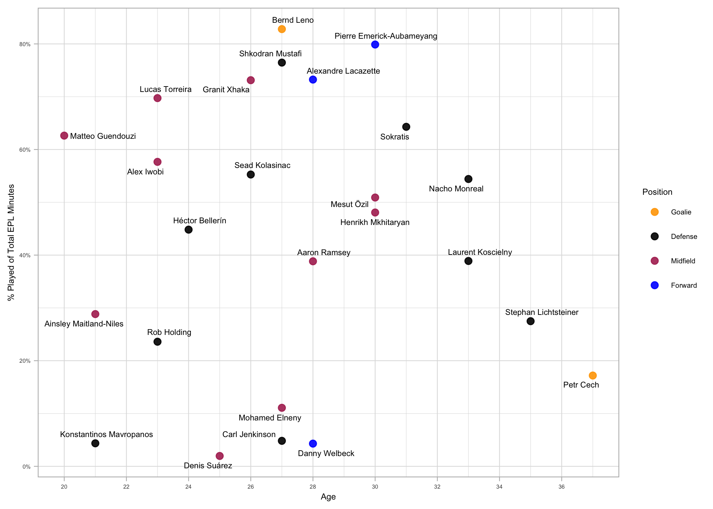
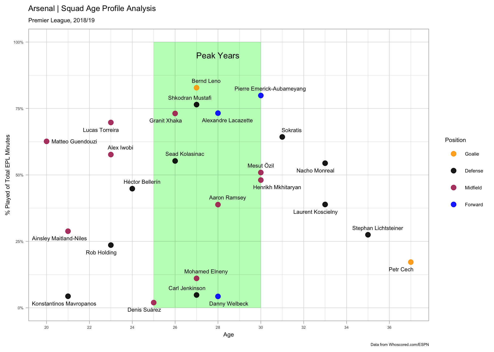

Arsenal Squad Age-Profile analysis
----------------------------------

This is small analytics exercise to examine the distribution of minutes
played based on the age of the players.

I got inspiration for this from the excellent
[http://petermckeever.com/2019/04/creating-squad-age-profiles/](article)
by @petermckeever.

His work was done in Python but I decided to try and re-create it using
R.

We will begin by scraping the player-ages for the squad from ESPNFC. One
thing I noticed was that they separated the goalie stats from the rest
of the squad so we will have to scrape two separate tables and combine
the data.

First, we’ll load our library dependencies and specify the squad page
URL we will be using.

``` r
library(tidyverse)
library(rvest)
library(lubridate)
library(stringr)
library(scales)

url <- "https://www.espn.com/soccer/team/squad/_/id/359/league/ENG.1/season/2018"
```

Next, we will scrape the goalie information. I had to check the page
source-code to determine the correct table-indexes.

``` r
goalie <- read_html(url) %>% 
  html_nodes("table") %>% 
  magrittr::extract2(3) %>% 
  html_table(fill = TRUE,  header = TRUE, trim = TRUE)
```

Now, we’ll extract the rest of the squad details from the 2nd table.

``` r
outfield <- read_html(url) %>% 
  html_nodes("table") %>% 
  magrittr::extract2(6) %>% 
  html_table(fill = TRUE,  header = TRUE, trim = TRUE)
```

Let’s combine both sets into a single dataframe and take a peek.

``` r
squad <- bind_rows(goalie, outfield)
```

Let’s continue by keeping only our columns of interest.

``` r
squad <- squad %>% 
  select(
    Name, 
    Position = POS, 
    Age, 
    HT, 
    WT, 
    NAT
    )
```

We can also see we need to do some cleanup on the player names which
annoyingly have their number appended at the end. We can take care of
this easily though with a string replace using a regular expression.
Let’s do a quick sanity-check before we make the update to our
dataframe.

``` r
squad %>% mutate(Name = str_replace(Name, "\\d+$", "")) %>% pull(Name)
```

    ##  [1] "Petr Cech"                 "Bernd Leno"               
    ##  [3] "Héctor Bellerín"           "Sokratis Papastathopoulos"
    ##  [5] "Laurent Koscielny"         "Stephan Lichtsteiner"     
    ##  [7] "Rob Holding"               "Nacho Monreal"            
    ##  [9] "Shkodran Mustafi"          "Carl Jenkinson"           
    ## [11] "Konstantinos Mavropanos"   "Sead Kolasinac"           
    ## [13] "Zech Medley"               "Bukayo Saka"              
    ## [15] "Mohamed Elneny"            "Henrikh Mkhitaryan"       
    ## [17] "Aaron Ramsey"              "Mesut Özil"               
    ## [19] "Lucas Torreira"            "Ainsley Maitland-Niles"   
    ## [21] "Alex Iwobi"                "Denis Suárez"             
    ## [23] "Matteo Guendouzi"          "Granit Xhaka"             
    ## [25] "Joseph Willock"            "Alexandre Lacazette"      
    ## [27] "Pierre-Emerick Aubameyang" "Danny Welbeck"            
    ## [29] "Edward Nketiah"

OK, we can see the player-numbers were correctly removed from the Names
so we’ll go ahead and perform this cleaning step on our dataframe. While
we’re at it, let’s also remove the “lbs” label from the WT column and
convert it to an integer.

``` r
squad <- squad %>% 
  mutate(Name = str_replace(Name, "\\d+$", "")) %>% 
  mutate(WT = as.integer(str_replace(WT, "lbs", ""))) 
```

    ## Warning in rlang::eval_tidy(~as.integer(str_replace(WT, "lbs", "")),
    ## <environment>): NAs introduced by coercion

Next, let’s convert our HT values to a standard of inches. We’ll have to
separate out our height-feet and height-inches to calculate total height
in inches.

``` r
(squad <- squad %>% separate(HT, c("feet","inches","drop")) %>% 
  select(-drop) %>% 
  mutate_at(c("feet","inches"), as.integer) %>% 
  mutate(HT = (feet*12) + inches) %>% 
  select(Name, Position, Age, HT, WT, NAT)
)
```

    ##                         Name Position Age HT  WT            NAT
    ## 1                  Petr Cech        G  37 77 198 Czech Republic
    ## 2                 Bernd Leno        G  27 75 183        Germany
    ## 3            Héctor Bellerín        D  24 70 161          Spain
    ## 4  Sokratis Papastathopoulos        D  31 73 181         Greece
    ## 5          Laurent Koscielny        D  33 73 163         France
    ## 6       Stephan Lichtsteiner        D  35 71 152    Switzerland
    ## 7                Rob Holding        D  23 74 163        England
    ## 8              Nacho Monreal        D  33 70 159          Spain
    ## 9           Shkodran Mustafi        D  27 72 181        Germany
    ## 10            Carl Jenkinson        D  27 73 170        England
    ## 11   Konstantinos Mavropanos        D  21 76 192         Greece
    ## 12            Sead Kolasinac        D  26 72 185        Germany
    ## 13               Zech Medley        D  19 77  NA        England
    ## 14               Bukayo Saka        D  17 70  NA        England
    ## 15            Mohamed Elneny        M  27 71 161          Egypt
    ## 16        Henrikh Mkhitaryan        M  30 70 163        Armenia
    ## 17              Aaron Ramsey        M  28 70 168          Wales
    ## 18                Mesut Özil        M  30 71 168        Germany
    ## 19            Lucas Torreira        M  23 66 139        Uruguay
    ## 20    Ainsley Maitland-Niles        M  21 70 157        England
    ## 21                Alex Iwobi        M  23 71 163        Nigeria
    ## 22              Denis Suárez        M  25 69 150          Spain
    ## 23          Matteo Guendouzi        M  20 73 139         France
    ## 24              Granit Xhaka        M  26 72 181    Switzerland
    ## 25            Joseph Willock        M  19 70 157        England
    ## 26       Alexandre Lacazette        F  28 69 161         France
    ## 27 Pierre-Emerick Aubameyang        F  30 74 174          Gabon
    ## 28             Danny Welbeck        F  28 72 161        England
    ## 29            Edward Nketiah        F  20 69 159        England

For our final cleaning step, we will convert the POS column which holds
the player’s position to a factor and change the level names.

``` r
squad <- squad %>% 
  mutate(Position = as.factor(Position))

levels(squad$Position) <- c("Defense","Forward","Goalie","Midfield")
```

Now, we’ll load our player-ratings data that was scraped from
[WhoScored.com](http://whoscored.com)

``` r
ratings <- readRDS("arsenal_whoscored_player_ratings.rds") %>% as_tibble
```

We’ll aggregate to the player-level taking the average of their rating
and calculate total minutes played.

``` r
player_agg <- ratings %>% 
  group_by(player_name) %>% 
  summarise(
    total_mins = sum(minutes_played),
    avg_rating = mean(rating)
            ) %>% 
  arrange(desc(total_mins))
```

Now, we’ll combine our aggregated player dataframe with our squad
profile. This will serve as our datasource for our viz. I did have to
make edits to Aubameyang’s and Sokratis’s names so that their data would
align with our ratings data.

``` r
squad[27,"Name"] = "Pierre Emerick-Aubameyang"
squad[4, "Name"] = "Sokratis"

afc <- inner_join(squad, player_agg, by=c("Name"="player_name"))
```

Now, let’s produce our viz.

``` r
theme_set(theme_light())

afc %>% 
  ggplot(aes(x = Age, y = total_mins/(38*90), label = Name)) +
  geom_point(aes(color = Position), size = 3.0, alpha = 0.9) +
  geom_text(size = 3, vjust = "middle", hjust = "left", nudge_x = 0.3) +
  scale_color_manual(values = c("navy","purple","yellow","maroon")) +
  scale_x_continuous(breaks = seq(18,40, by=2)) +
  scale_y_continuous(labels = scales::percent_format()) +
  labs(y = "% of Total EPL Minutes")
```


We can see the graph looks a bit easy with some overlapping names. We
can use the `check_overlap` property to help deal with this, but I found
it removed several key players from the graph.

Another option to clean things up is by showing only the last-name.
We’ll use the handy tidyr `extract` function to accomplish this.

``` r
(
  afc <- extract(afc, Name, c("fname","lname"), "([^ ]+)(.*)", remove = FALSE)
)
```

    ##                         Name        fname               lname Position Age
    ## 1                  Petr Cech         Petr                Cech   Goalie  37
    ## 2                 Bernd Leno        Bernd                Leno   Goalie  27
    ## 3            Héctor Bellerín       Héctor            Bellerín  Defense  24
    ## 4                   Sokratis     Sokratis                      Defense  31
    ## 5          Laurent Koscielny      Laurent           Koscielny  Defense  33
    ## 6       Stephan Lichtsteiner      Stephan        Lichtsteiner  Defense  35
    ## 7                Rob Holding          Rob             Holding  Defense  23
    ## 8              Nacho Monreal        Nacho             Monreal  Defense  33
    ## 9           Shkodran Mustafi     Shkodran             Mustafi  Defense  27
    ## 10            Carl Jenkinson         Carl           Jenkinson  Defense  27
    ## 11   Konstantinos Mavropanos Konstantinos          Mavropanos  Defense  21
    ## 12            Sead Kolasinac         Sead           Kolasinac  Defense  26
    ## 13            Mohamed Elneny      Mohamed              Elneny Midfield  27
    ## 14        Henrikh Mkhitaryan      Henrikh          Mkhitaryan Midfield  30
    ## 15              Aaron Ramsey        Aaron              Ramsey Midfield  28
    ## 16                Mesut Özil        Mesut                Özil Midfield  30
    ## 17            Lucas Torreira        Lucas            Torreira Midfield  23
    ## 18    Ainsley Maitland-Niles      Ainsley      Maitland-Niles Midfield  21
    ## 19                Alex Iwobi         Alex               Iwobi Midfield  23
    ## 20              Denis Suárez        Denis              Suárez Midfield  25
    ## 21          Matteo Guendouzi       Matteo           Guendouzi Midfield  20
    ## 22              Granit Xhaka       Granit               Xhaka Midfield  26
    ## 23       Alexandre Lacazette    Alexandre           Lacazette  Forward  28
    ## 24 Pierre Emerick-Aubameyang       Pierre  Emerick-Aubameyang  Forward  30
    ## 25             Danny Welbeck        Danny             Welbeck  Forward  28
    ##    HT  WT            NAT total_mins avg_rating
    ## 1  77 198 Czech Republic        588   7.050000
    ## 2  75 183        Germany       2832   6.682188
    ## 3  70 161          Spain       1533   6.714211
    ## 4  73 181         Greece       2199   6.815200
    ## 5  73 163         France       1330   6.917647
    ## 6  71 152    Switzerland        940   6.292143
    ## 7  74 163        England        807   6.740000
    ## 8  70 159          Spain       1861   6.969091
    ## 9  72 181        Germany       2615   7.060968
    ## 10 73 170        England        165   6.310000
    ## 11 76 192         Greece        149   6.610000
    ## 12 72 185        Germany       1890   6.609583
    ## 13 71 161          Egypt        379   6.462500
    ## 14 70 163        Armenia       1644   6.877600
    ## 15 70 168          Wales       1328   6.703929
    ## 16 71 168        Germany       1741   6.777500
    ## 17 66 139        Uruguay       2385   6.727353
    ## 18 70 157        England        986   6.635625
    ## 19 71 163        Nigeria       1972   6.622000
    ## 20 69 150          Spain         67   6.162500
    ## 21 73 139         France       2142   6.559394
    ## 22 72 181    Switzerland       2501   7.027931
    ## 23 69 161         France       2505   7.171714
    ## 24 74 174          Gabon       2732   7.097500
    ## 25 72 161        England        147   6.393750

``` r
afc[4, "lname"] = "Sokratis"

q <- afc %>% 
  ggplot(aes(x = Age, y = total_mins/(38*90), label = lname)) +
  geom_point(aes(color = Position), size = 3.0, alpha = 0.9) +
  geom_text(size = 3, vjust = "top", hjust = "middle", nudge_y = -0.02, nudge_x = 0.5) +
  scale_color_manual(values = c("navy","purple","yellow","maroon")) +
  scale_x_continuous(breaks = seq(18,40, by=2)) +
  scale_y_continuous(labels = scales::percent_format()) +
  labs(y = "% Played of Total EPL Minutes")

q
```



This looks good but let’s go one-step farther by adding a shaded region
showing the peak age-bracket which we’ll define as from 25 - 30 years
old.

``` r
q <- q + geom_rect(fill = "green", alpha = 0.01, aes(xmin=25, xmax=30, ymin=0, ymax=1))
```

we’ll wrap up by adding a title and some annotations.

``` r
q + labs(
  title = "Arsenal | Squad Age Profile Analysis",
  subtitle = "Premier League, 2018/19",
  caption = "Data from Whoscored.com/ESPN"
) +
  annotate("text", x = 28, y = 0.95, label = "Peak Years", size = 4.0) +
  annotate("text", x = 36.5, y = 0.99, label = "@DesiGoonerMD", size = 2.5)
```


